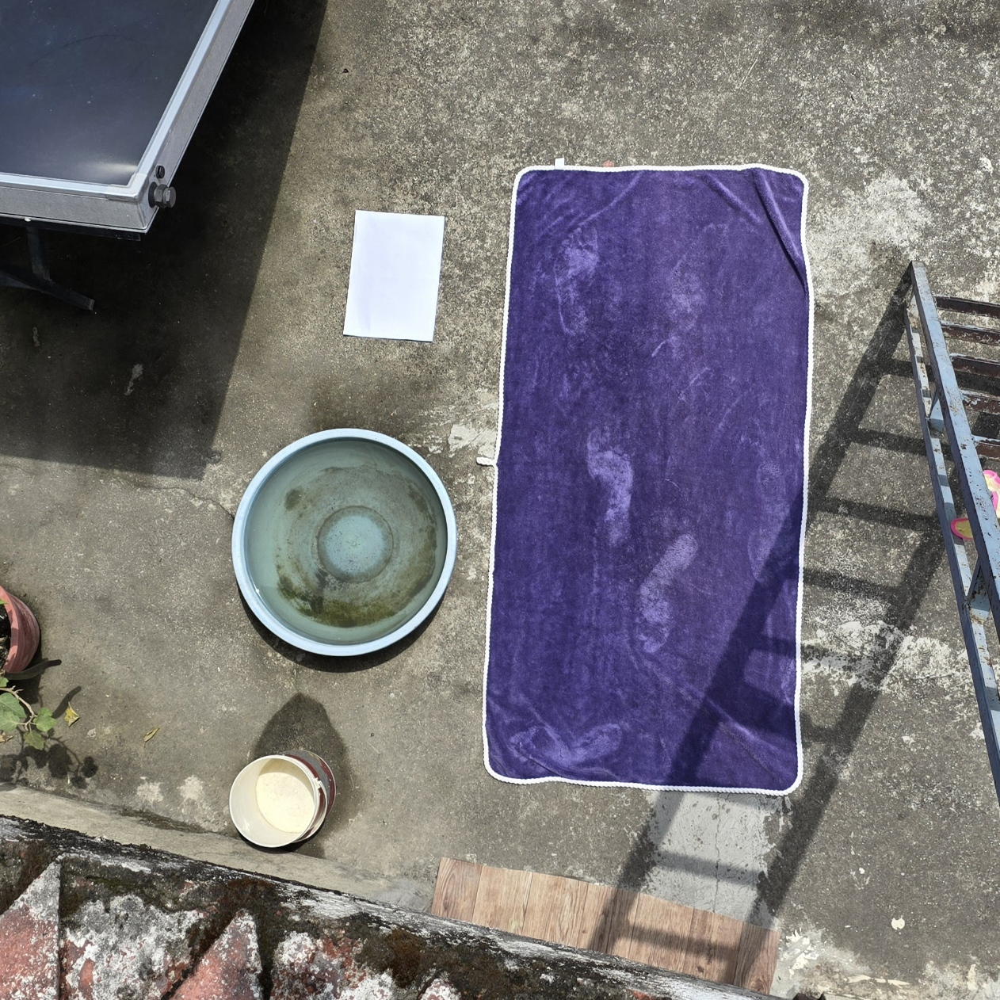

# 🛰️ Rooftop Surface Area Calculator

This Python application calculates the surface area of a rooftop from drone-captured images using an A4 sheet as a reference for real-world scaling. It allows users to interactively select the A4 paper and the rooftop area to compute an accurate surface area in square millimeters.

## 📸 How It Works

1. **Input Image**: The image must contain:
   - The rooftop whose area you want to measure.
   - An A4 paper placed on a flat surface in the same plane as the rooftop (used for scale calibration).
   
2. **User Interaction**:
   - Select **4 corners** of the A4 paper using left mouse clicks.
   - Then, select **polygon points** around the rooftop.
   - Press **Enter** to calculate the area, or **Esc** to cancel.

3. **Output**:
   - Displays the estimated surface area in **square millimeters**.

## 📦 Requirements

Install dependencies using:

```bash
pip install -r requirements.txt
```

### `requirements.txt`
```
opencv-python
numpy
```

## 🚀 How to Run

```bash
python rooftop_area_calculator.py
```

Then follow the on-screen instructions to click:
- Four A4 corner points.
- Multiple points around the rooftop.
- Press `Enter` to compute.

## 🧠 How Area is Calculated

- The A4 paper (210mm × 297mm) is used to calculate pixel-to-mm scale.
- A polygon is formed using your clicked rooftop points.
- The **shoelace algorithm** is used to compute the area in pixels.
- The area is converted to real-world units using the scale.
- Video URL: https://github.com/Rishikesh0523/drone-images-surface-area-calculator

## 🧾 Example Use Case

- **Solar Panel Installation**: Estimate usable rooftop area.
- **Building Analysis**: Calculate rooftop size from aerial images.
- **Construction Planning**: Measure outdoor structures remotely.

## 📂 Sample Input

Make sure your image contains a visible A4 paper placed flat and ideally on the same plane as the rooftop:



## ✍️ Notes

- Accuracy depends on image quality and correct point selection.
- Ensure A4 paper lies flat and is not distorted in perspective too much.
